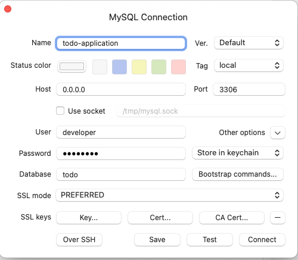

# Go To Do Application

## Description

東京工業大学 情報理工学院 情報工学系 システム設計演習 (2022 3Q)

講義ページ: https://cs-sysdes.github.io/lecture-note/index.html

評価方法: https://cs-sysdes.github.io/about.html

レポート課題: https://cs-sysdes.github.io/report.html

仕様: https://cs-sysdes.github.io/todolist.html

## Development Flow

1. フロントエンドとはつなぎこまず、JSON を返す API を作成する
2. フロントエンド実装
3. フロントエンドと API をつなぎこむ
4. テストを書く (余裕があれば)
5. レポート作成

開発過程でのメモは [docs/]にあります。

### Local Environment

macOS 13.0.1 (arm64)

## Environments

- Go Gin

  ドキュメント(日本語): https://gin-gonic.com/ja/docs/examples/

- Air: https://github.com/cosmtrek/air

  本プロジェクトでは、本番環境へのデプロイを想定していないため、開発体験を向上させる目的から、Air を使用している。

- wait-for-it:

  GitHub: https://github.com/vishnubob/wait-for-it

  docker-compose.yaml にて、DB が起動するまで待機するために使用している。

  具体的には、以下の部分である。

  ```yaml
  depends_on:
    - db
  command:
    - wait-for-it.sh
    - db:3306
    - --timeout=60
    - --strict
    - --
    - air
    - -c
    - .air.toml
  ```

  MySQL の起動を待ってから、Air を起動するようにしている。

## How to setup

`docker-compose up -d`を行うだけでよい。

詳細説明

- フロントエンド

  http://localhost:3000 にアクセスすると、root にアクセスできる。

  Chrome 拡張機能 React Developer Tools をインストールすると、React のコンポーネントを確認することができる。

- バックエンド

  http://localhost:8000 にアクセスすると、root にアクセスできる。
  基本的には、フロントエンドからのリクエストに対して、レスポンスを返すだけの役割を持つ。

  講義で扱ったような、HTML を返すような処理は行わない。（純粋な REST API として振る舞う）

- データベース

  phpMyAdmin は導入していない。代わりに Table Plus でのアクセス方法を記す

  - Name: 好きな名前(例: todo-application)
  - Host: 0.0.0.0
  - Port: 3306
  - User: developer
  - Password: password

  以下のようなになっていれば、接続できる。

  

## Directory Structure

```bash
.
├── README.md
├── docker
│   ├── development   <-- for local development
│   └── production    <-- for production
├── docker-compose.yaml
├── docs
│   ├── docker.md
│   └── git.md
├── server            <-- server side
│   ├── api
│   ├── config
│   ├── controllers
│   ├── db
│   ├── go.mod
│   ├── go.sum
│   ├── helpers
│   ├── main.go
│   ├── models
│   ├── router
│   └── tmp
└── web               <-- client side
    ├── README.md
    ├── next-env.d.ts
    ├── next.config.js
    ├── node_modules
    ├── package.json
    ├── pages
    ├── public
    ├── styles
    ├── tsconfig.json
    └── yarn.lock
```

## References

### Go + Next.js

- Next.js + Go でクイズアプリを作ってみる: https://qiita.com/kmnky/items/614a22d6724a85dee0da#api%E3%81%A8%E3%81%AE%E7%B9%8B%E3%81%8E%E8%BE%BC%E3%81%BF

- Go 言語と Vue.js で作るユーザー認証アプリ: https://selfnote.work/20210204/programming/create-authentication-app-with-golang-and-vue3-4/

### Gin REST API

- Go Gin で REST API を作ってみる: https://zenn.dev/a_ichi1/articles/67b51de22475f9#docker-compose.yml

### Gin + MySQL

- go-gin, mysql (migration): https://qiita.com/greenteabiscuit/items/282ae184b3aad7edf92f#%E3%83%9E%E3%82%A4%E3%82%B0%E3%83%AC%E3%83%BC%E3%82%B7%E3%83%A7%E3%83%B3%E3%81%AE%E3%81%9F%E3%82%81%E3%81%AEsql%E3%83%95%E3%82%A1%E3%82%A4%E3%83%AB

### Go + Air

- Docker コンテナで golang をホットリロードする Air を導入: https://zenn.dev/ajapa/articles/bc399c7e4c0def
- Go + echo + Air + Docker: https://qiita.com/345dvl/items/1dd12e19f10de034e0f5#docker%E3%81%AE%E5%B0%8E%E5%85%A5
- Go + gin + air: https://zenn.dev/hrs/articles/go-gin-air-docker#.air.toml%E3%81%AE%E7%94%9F%E6%88%90

### wait for DB start

- wait-for-it: https://github.com/vishnubob/wait-for-it
- Go Docker DB に connection refused されたときの対処法: https://zenn.dev/yoji/articles/5386d040587f83

### SQL Formatter

- vscode で SQL をフォーマットしたい: https://qiita.com/Daara_y/items/6c1ddfa141d38a22e58d

### TablePlus

- TablePlus で MySQL に接続する: [https://reffect.co.jp/windows/tableplus-connect-mysql-sqlite](https://reffect.co.jp/windows/tableplus-connect-mysql-sqlite#:~:text=MySQL%E3%83%87%E3%83%BC%E3%82%BF%E3%83%99%E3%83%BC%E3%82%B9%E3%81%B8%E3%81%AE%E6%8E%A5%E7%B6%9A,-MySQL%E3%83%87%E3%83%BC%E3%82%BF%E3%83%99%E3%83%BC%E3%82%B9%E3%81%B8&text=TablePlus%E3%81%AE%E3%82%A2%E3%83%97%E3%83%AA%E3%82%B1%E3%83%BC%E3%82%B7%E3%83%A7%E3%83%B3%E3%82%92%E8%B5%B7%E5%8B%95,%E5%8F%B3%E3%82%AF%E3%83%AA%E3%83%83%E3%82%AF%E3%82%92%E8%A1%8C%E3%81%84%E3%81%BE%E3%81%99%E3%80%82&text=open_tableplus-,%E5%8F%B3%E3%82%AF%E3%83%AA%E3%83%83%E3%82%AF%E3%82%92%E5%AE%9F%E8%A1%8C%E3%81%99%E3%82%8B%E3%81%A8%E3%81%95%E3%82%89%E3%81%AB%E9%81%B8%E6%8A%9E%E7%94%BB%E9%9D%A2%E3%81%8C%E8%A1%A8%E7%A4%BA,%E3%82%92%E9%81%B8%E6%8A%9E%E3%81%97%E3%81%A6%E3%81%8F%E3%81%A0%E3%81%95%E3%81%84%E3%80%82&text=MySQL%E3%82%92%E9%81%B8%E6%8A%9E%E3%81%97%E3%81%A6Create%E3%83%9C%E3%82%BF%E3%83%B3%E3%82%92%E6%8A%BC%E3%81%97%E3%81%A6%E3%81%8F%E3%81%A0%E3%81%95%E3%81%84%E3%80%82)

### ECS

- AWS ECS で自動デプロイを組んでみる: https://zenn.dev/ttani/articles/aws-ecs-autodeploy

### Auth

- Auth0×Golang で認証認可の処理を実施する: https://qiita.com/kouji0705/items/a8790ff4e72574f9c5f1
